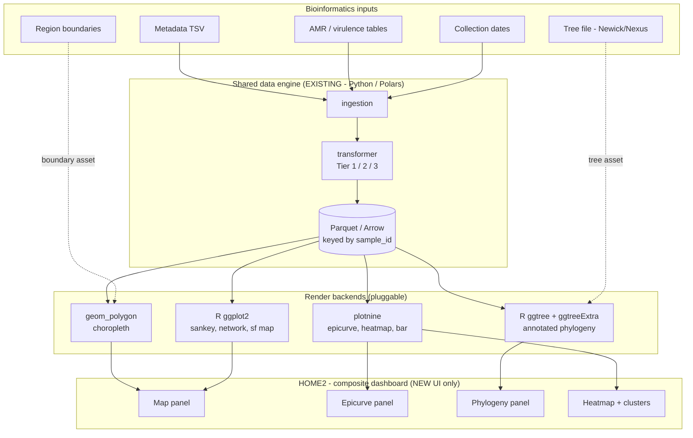
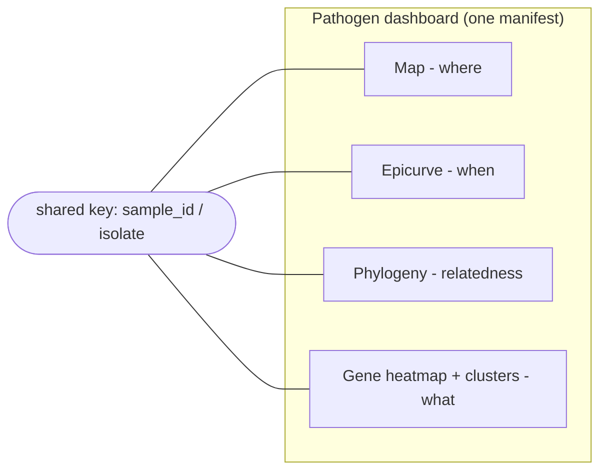

# Composite Dashboard ("HOME2") — Mixed-Data Bioinformatics Views

**Status:** EXPLORATORY — vision summary, nothing decided. Return-to-and-discuss.
**Author:** @dasharch
**Date:** 2026-05-22
**Related:** [`dashboard_frontend_topology.md`](dashboard_frontend_topology.md) (HOME2 space vs. separate "app2" viewer), [`r_backend.md`](r_backend.md), [`bioinformatics_viz.md`](bioinformatics_viz.md), [`../../maps_advanced_geo.md`](../../maps_advanced_geo.md), `../spaces/FUTURE_SPACES.md`

---

## 1. The idea in one line

A **Microreact-style** user space where one isolate dataset feeds several panels of *different* visual types — map, epicurve, phylogenetic tree, gene heatmap with clusters — composed into a single dashboard, possibly pathogen-specific. The novelty is **only the UI + render backends**; the data engine and libraries underneath are the ones we already have.

---

## 2. The cohabitation model: one engine, many renderers

The whole architecture already separates **data** from **rendering**. That is what makes mixed-data dashboards cheap to add:

- The **data engine** (ingestion → transformer Tier 1/2/3 → Parquet/Arrow) is visualization-agnostic. It produces one tidy, contract-checked frame keyed by `sample_id` / isolate.
- **VizFactory** is an abstraction (`render(df, plot_config) -> image`). Different panels just dispatch to different render backends — all consuming the *same* tabular frame (plus, for some, a side asset).

| Panel type | Render backend | New work | Side asset |
|---|---|---|---|
| Epicurve, bar, box, heatmap | plotnine (today) | none | — |
| Choropleth map | `geom_polygon` (Solution A) | boundary fortifier | boundary table |
| sf map / Sankey / network | R ggplot2 via Rscript+Arrow | R backend (opt-in) | — |
| **Annotated phylogeny** | R ggtree/ggtreeExtra | R backend (opt-in) | tree file |

Specialized panels (map, tree) follow one repeating pattern: **a non-tabular asset (boundary / tree) + the tabular metadata frame, joined at render time by the shared key.** Maps call it `geo_source`; trees call it `tree_source`. Same shape.

---

## 3. Data flow



---

## 4. The dashboard, and what links the panels

The Microreact insight: every panel is a **view of the same isolates**, linked by the shared key. The tree tip, the map point, the heatmap row, and the epicurve bucket are all the *same* `sample_id`.



Two levels of ambition:

- **Level 1 — static composite (achievable, near-term).** A manifest declares a multi-panel layout; each panel renders independently from the shared frame. No interaction between panels. This is "several plots on one page, sharing data" — a layout feature over the existing engine.
- **Level 2 — linked / cross-filtering (the hard part, Microreact's signature).** Selecting a clade on the tree highlights those isolates on the map and filters the epicurve. This needs a **shared client-side selection state** and server round-trips per panel — a substantial new interactivity layer, and the static R renderers (PNG/SVG from Rscript) are not natively interactive, so linking with an R tree panel is genuinely hard. Honest call: Level 1 first; Level 2 is its own major project.

---

## 5. What is reused vs. genuinely new

| Layer | Reused as-is | New |
|---|---|---|
| ingestion / connector | ✅ all of it | — |
| transformer (Tier 1/2/3 assembly) | ✅ all of it | maybe a "multi-dataset bundle" notion |
| viz_factory (plotnine charts) | ✅ all of it | render-backend dispatch |
| blueprint_arch (manifest nav) | ✅ | composite-layout authoring |
| Manifest contract | ✅ grammar | a `dashboard:` / `composite_layout:` block (panels + positions + per-panel plot ref) |
| **UI** | sidebars, theater shell patterns | **HOME2 space: panel grid layout, panel registry** |
| **Render backends** | — | R (ggplot2 / ggtree) opt-in, geom_polygon maps |

So the spirit of your instinct is right: **add/rewrite UI for this part only, leverage all existing libraries.** HOME2 is a new user space (joining HOME / BLUEPRINT / TEST_LAB / GALLERY), persona-gated like the others, that composes existing render outputs into a grid.

---

## 6. Manifest sketch (composite layout)

```yaml
dashboard:                       # NEW top-level block (HOME2)
  id: campylobacter_surveillance
  shared_key: sample_id
  layout: grid                   # grid | tabs | free
  panels:
    - id: where
      position: {row: 1, col: 1}
      plot: !include plots/map_by_county.yaml          # geom_polygon backend
    - id: when
      position: {row: 1, col: 2}
      plot: !include plots/epicurve.yaml               # plotnine backend
    - id: relatedness
      position: {row: 2, col: 1}
      plot: !include plots/isolate_tree.yaml           # ggtree backend (tree_source)
    - id: what
      position: {row: 2, col: 2}
      plot: !include plots/amr_gene_heatmap.yaml       # plotnine backend
```

Each panel's `plot` is an ordinary plot spec — its `plot_type` / layers decide which backend renders it. The dashboard block only adds **composition** (which panels, where, and the shared key); it does not invent new plotting.

---

## 7. Pathogen-specific dashboards

Because the dashboard is just a manifest, a pathogen-specific view (e.g. *Campylobacter* vs *E. coli* vs *S. aureus*) is a **manifest, not code** — different panels, different annotation columns (serotype vs MLST vs resistance gene), same engine and same HOME2 shell. This matches the existing "Factory Pattern" in `dasharch.md §5` (species → metadata mapping). Gallery could even ship pathogen dashboard templates.

---

## 8. Phasing (suggested, not scheduled)

1. **Decide the R-backend question** (`r_backend.md`) — gates tree/sf panels.
2. **Solution A choropleths** (`MAP-A-*`) — gives the map panel with zero new deps; usable in HOME2 immediately.
3. **HOME2 Level 1** — composite static layout over existing renderers (manifest `dashboard:` block + panel-grid UI). The first real "mixed dashboard."
4. **R backends** (ggtree first per `bioinformatics_viz.md`) — adds tree and sf panels.
5. **HOME2 Level 2** — linked cross-filtering. Major project; revisit only if the static dashboard proves the value.

---

## 10. Interactivity: the static-vs-live fork (roadmap-critical)

"Going away from static" needs unpacking — there are three levels, and the app is already past level 0:

| Level | What the user does | How it renders | In SPARMVET today? |
|---|---|---|---|
| **L0 Static** | nothing — fixed image | render once | export figures |
| **L1 Server-reactive** | filter / brush / toggle → view updates | server **re-renders** a fresh image per change | **YES** — T3 filters, brush→audit, tier toggle |
| **L2 Client-live** | pan / zoom / hover / linked-brush in the browser, no round-trip | **JS render layer** in the browser | no |

The app is already "interactive" at L1 (each frame is a freshly rendered static image sent to the client). Microreact's signature — click a clade, the map and epicurve highlight instantly — is **L2**, and that is where the architecture forks:

**The hard truth: L2 interactivity and the R/ggtree roadmap pull in opposite directions.**

- plotnine and R (ggplot2 / ggtree) produce **static raster/vector images**. They have *no* client-side interactivity. They are the best path for **publication-quality figures**.
- True L2 linked selection needs a **client-side JS plotting layer** — Leaflet (maps), Plotly / Vega-Lite (charts), Cytoscape.js / a phylo-JS lib (trees). **Microreact itself uses JS renderers, not ggtree**, precisely because ggtree output is a flat SVG.

So you cannot get ggtree's rendering *and* click-the-clade interactivity from the same artifact. They are two different rendering worlds sharing one data engine.

(Constraint check: L2 via server-side JS widgets is **allowed** — that is standard Shiny sending htmlwidgets/JS to the browser, *not* WASM/shinylive, so it does not violate `dasharch.md §2`.)

---

## 11. How the roadmaps interrelate — and what the survey should decide

The roadmaps "help each other" at the **trunk**, not the **renderer**:

| Investment | Serves | Reusable across both forks? |
|---|---|---|
| Data engine + manifest + shared-key + **HOME2 composition shell** | everything | **YES — the common trunk. Build once, both forks ride it.** |
| **R static backend** (ggtree, sankey, sf maps) | publication figures, reports | static only — not interactive |
| **JS interactive layer** (Leaflet, Plotly/Vega, Cytoscape) | live linked dashboards (true Microreact) | interactive only — cannot reuse plotnine/R renderers |

Two consequences:

1. **The HOME2 shell + shared-key linking is worth building regardless of the fork** — it is the part both roadmaps need. A static R tree panel and an interactive Leaflet map panel can even sit side by side in the same HOME2 grid (they just don't cross-link until both are interactive).
2. **The fork is a genuine either/or at the render layer** — and that is exactly what the survey should resolve.

**What the survey should disambiguate (to justify prioritization):**

1. **Purpose** — do people need *live exploration*, *publication/report figures*, or *both*? (This single answer picks the fork.)
2. **Panel types** — which are must-have: map, phylogeny, epicurve, gene heatmap, gene map, MSA?
3. **Per panel: interact vs view** — do they need to zoom/select/link, or just see it? (A panel can be "view-only static" cheaply even in an interactive dashboard.)
4. **Linked cross-filtering** — genuinely needed (the expensive L2 feature), or is independent per-panel filtering enough?
5. **Where consumed** — in-app live dashboard vs exported report vs both? (Report-only ⇒ static R/plotnine wins; live ⇒ JS layer.)
6. **Pathogens / data types** in scope (drives which panel types and which annotation columns).

The clean reading: if the survey says **"publication figures + richer chart breadth"** → invest in the **R static backend** (ggtree first). If it says **"live linked exploration like Microreact"** → invest in the **JS interactive layer**. Either way, **build the shared trunk (HOME2 shell + shared key) first**, because it is not wasted under either outcome.

---

## 12. Open questions

1. Is HOME2 a new user space, or a manifest-driven mode of HOME? (Leaning: new space — distinct layout model.)
2. Multi-dataset: does a dashboard ever need panels from *different* assembled frames, or always one shared frame? (Affects the engine's "bundle" notion.)
3. Level 2 linking — worth the interactivity cost, or is static export-quality composition the actual need? (Microreact is interactive; a surveillance *report* may not need to be.)
4. How do static R-rendered (PNG/SVG) panels coexist with interactive Python panels in one grid? (They can sit side by side statically; they cannot cross-link without an interactive R path.)
5. Does this overlap/merge with anything already in `../spaces/FUTURE_SPACES.md`?
