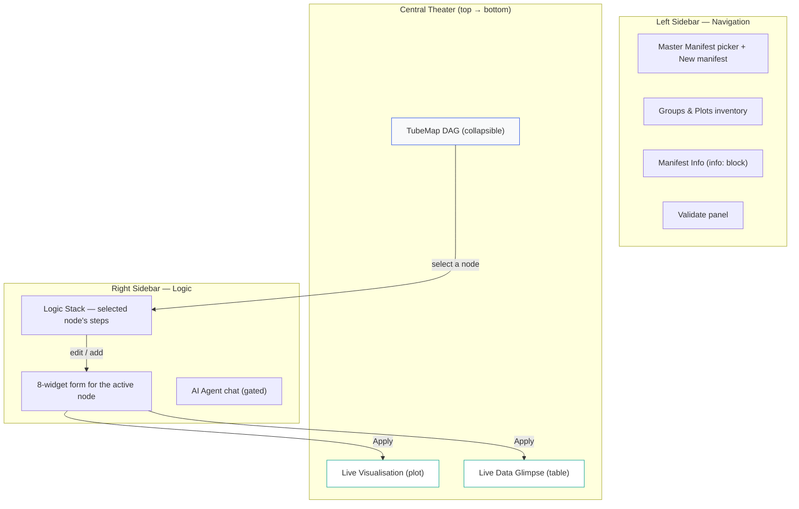
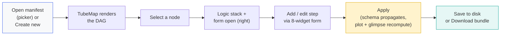
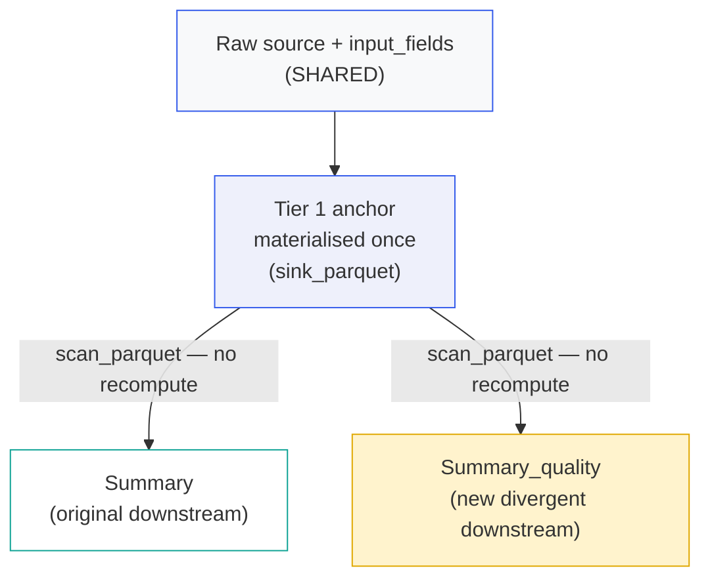

# The BLUEPRINT Architect

BLUEPRINT is the visual IDE for **building and editing SPARMVET pipeline manifests without
writing YAML by hand**. Its output is an ordinary manifest file that loads directly into HOME.

The whole design rests on one split:

> **HOME users produce science from a pipeline. BLUEPRINT users produce and document pipelines.**

That sentence (ADR-082) is the spine of every decision in this document. It explains why
BLUEPRINT writes Tiers 1 and 2 but never Tier 3, why branching shares an upstream trunk, and
why the AI agent advises rather than edits. Keep it in mind as you read.

This page is the developer/architecture reference — it explains *how* each surface works and
*why* it was built that way. For the step-by-step "I am a scientist authoring my first
manifest" guide, see the user guide chapter on manifest authoring.

---

## 1. The Four-Layer Feature Lock

BLUEPRINT is locked into four composable layers (ADR-082 §1). Each layer has an owning ADR;
the value of naming them together is that a new contributor can read one model end-to-end.

| Layer | What it gives you | Owning ADR(s) |
|---|---|---|
| **L1 — Navigation** | TubeMap DAG (the primary surface) + Lineage Rail + 3-column contract viewer | ADR-039, ADR-040, ADR-074 |
| **L2 — Forms** | Action/component picker + an 8-widget form renderer driven by `ui_schema` | ADR-075 |
| **L3 — Data view** | Live Data Glimpse (recomputed on Apply) | ADR-082 |
| **L4 — Helpers** | AI agent + YAML escape hatch + 20-step undo + node-level branching | ADR-075, ADR-076 |

The capability set is gated by the `blueprint_enabled` persona flag. Two advanced helpers
carry their own flags: the **editable** YAML escape hatch and any manifest-mutating action
require `manifest_edit_enabled`; the AI agent requires `blueprint_agent_enabled`. Both child
flags are *fatal-cascade* gated — if `blueprint_enabled` is false but a child flag is true, the
app refuses to start rather than silently disabling the child (ADR-077). See the persona
chapter for the full flag matrix.

---

## 2. The Workspace Surfaces

BLUEPRINT implements the "Flight Deck" layout (`rules_ui_dashboard.md §7`): a central vertical
stack flanked by a navigation sidebar (left) and a logic sidebar (right).



- **TubeMap (L1):** the manifest rendered as a directed graph — data schemas feed joins, joins
  feed plots. It is the primary navigation surface and is collapsible to reclaim vertical space.
  Rendered from `BlueprintMapper (blueprint_mapper.py)` via `ManifestNavigator (manifest_navigator.py)`.
- **Central stack:** TubeMap on top, the live plot in the middle, the live Data Glimpse at the
  bottom. The plot and glimpse recompute **on Apply** (not continuously — see §4).
- **Right sidebar (L2/L4):** when you select a node in the TubeMap, the right sidebar shows that
  node's logic stack and opens the form for the active step. The AI agent chat lives here too
  when enabled.

---

## 3. Authoring Workflow — Open to Save

The end-to-end flow for editing an existing pipeline:



### Open or create

- **Open existing:** pick a manifest from the Master Manifest selector; the TubeMap renders the
  full DAG. (Functionality #1, DONE.)
- **Create new:** the "New manifest" button opens a modal (slug / name / description / author),
  validates the slug is snake_case, and writes a minimal YAML stub
  (`info:` / `data_schemas` / `join_manifests` / `analysis_groups`) to
  `config/manifests/pipelines/{slug}.yaml`, then selects it. (BP-NEW-1.)

### Select a node and fill its form

The form layer is driven entirely by `ui_schema` dicts embedded in each `@register_action`
and `@register_plot_component` decorator. At startup, `server.py` injects those schemas into
`schema_registry (schema_registry.py)`, which builds the picker catalog. There are **no
hardcoded form layouts** — the form is generated from the schema (ADR-075 §1).

The 8-widget vocabulary (ADR-075 §2):

| Widget | Used for |
|---|---|
| `column_selector` | Pick one or more columns from the upstream schema (`dtype_filter` narrows by type) |
| `expression` | A Polars expression string (schema-aware code editor — used by `mutate.expression`) |
| `enum` | A fixed option list (`preview: true` renders a visual sample, e.g. linetype) |
| `dtype_picker` | A Polars dtype |
| `number` | A numeric scalar |
| `string` | Free text |
| `color` | A colour aesthetic binding (map-to-column vs literal) |
| `column_or_literal` | Map to a column OR set a literal value — the ggplot/plotnine distinction |

The **Add node** picker is searchable by tags/label and filtered by `context` so it only offers
actions valid at the selected insertion point. The `context` tag enforces DAG validity at
authoring time:

| `context` | Valid position |
|---|---|
| `t1` | Before any join (Tier 1 wrangling) |
| `t2` | After a join, before a plot (Tier 2 wrangling) |
| `assembly` | Join nodes connecting data sources |
| `plot` | Leaf positions — viz_factory layers |

**Add == Edit** (ADR-082 §5): adding a node creates a stub with empty params and immediately
opens it in the same rich form you use to edit an existing node. There is no separate
primitive add-UI.

### Apply, then save

**Apply is the commit point inside a session.** Editing a node marks it pending; pressing
Apply propagates the schema through the DAG and recomputes the live plot and Data Glimpse.
This "on-Apply, not live" model (ADR-082 Q1) mirrors HOME's T3 Apply gate so the two
workspaces share one mental model.

Apply does **not** touch disk. Two separate actions persist:

- **Save** (`btn_save_internal`) writes the currently-loaded component file in its native shape:
  a plot spec serialises to `mapping:` + `layers:`; wrangling nodes route back to their source
  tier (`tier1` / `tier2`). Save requires the component to have been loaded **from a file** —
  inline components must be edited via the YAML escape hatch (BP-PLOT-COMMIT-1).
- **Download** (`btn_download_manifest`) emits the full multi-file manifest as a zip bundle —
  the master plus its mirrored `basename/` fragment tree.

::: {.callout-important}
### BLUEPRINT never writes Tier 3
BLUEPRINT authors `input_fields`, `wrangling.tier1`, `wrangling.tier2`, `join_manifests`,
`output_fields` / `final_contract`, `analysis_groups`, and plot specs. It **never** writes T3
audit nodes (filters, exclusions, column drops, aesthetic overrides) — those are authored
exclusively in HOME by the analyst (ADR-082 §4). An earlier bug dumped the logic stack into
`wrangling.tier3` and wiped tier1/tier2; it was fixed in BP-PLOT-COMMIT-1. This boundary is a
hard invariant — surfacing T3 in BLUEPRINT would require a superseding ADR.
:::

---

## 4. Lineage Bifurcation (Branching) — the part people get wrong

Branching is the most misunderstood BLUEPRINT feature, so it gets the most detail.

### What a branch *is*

A "branch" in the manifest sense is a **lineage bifurcation at a chosen node** (ADR-082 Q3,
LOCKED). You pick a node; everything **upstream of it stays shared**, and a new **divergent
downstream** is created. This is the *Bifurcation Point Rule* from `rules_data_engine.md` made
interactive.



The canonical example is the `Summary` / `Summary_quality` pattern: both share the same
`source` and `input_fields`, then diverge in their `wrangling` and `output_fields`. Physically,
the branch is a new `!include` fragment wired into the master manifest — the same
fragment-per-component structure the manifest already uses.

The runtime payoff: the shared upstream Tier 1 anchor is materialised **once** via
`sink_parquet`; both branches read it via `scan_parquet`. **No recompute** for the shared
trunk — only the divergent tail re-runs.

### When to branch a `data_schema` — and when not to

This is the guidance surfaced directly in the Branch panel for `data_schema` nodes
(BP-BRANCH-UX-1):

::: {.callout-tip}
### Branch a data schema only for genuinely different processing paths
Branch a `data_schema` only when you need two **distinct processing units** from the same raw
data — different QC thresholds, different reference databases, splitting by instrument type —
cases where the two halves diverge *from the raw input* and follow entirely different paths.

For analytical variations — different plots, different aggregations or filters of the *same*
processed data — **branch at the assembly (join) or plot level instead**. Those branches share
the materialised Tier 1 anchor at runtime with zero recompute, whereas each `data_schema`
branch triggers a full independent assembly.
:::

The rule of thumb: **branch as late as possible.** The later the bifurcation point, the more of
the trunk is shared and the cheaper the branch.

### Why the divergent fragment seeds *empty*

When you branch a `data_schema` or a `join`, the new fragment is created **empty**, not
prefilled from the original:

| Branch role | Shared (by reference / inline copy) | Divergent (new, empty) |
|---|---|---|
| `data_schema` | `source` (copied inline), `input_fields` (`!include` reused) | `wrangling` → `tier1: []` / `tier2: []`; `output_fields` → `{}` |
| `join` (assembly) | `ingredients` (copied inline) | `recipe` → `[]`; `output_fields` → `{}` |
| `plot` (leaf) | `target_dataset` (carried inside the copied spec) | a **copy** of the original spec (see below) |

The empty seed is deliberate and matches the Tier-1-shared / Tier-2-diverges mental model: the
shared trunk is what you keep; the divergent tail is what you are about to author differently.
A prefilled copy would imply "tweak from here," which is the wrong frame — if you wanted a tweak
you would edit the original, not branch it. The canonical `Summary_quality` fragment is itself
empty-wrangling with its own `output_fields`, so the seed matches the established pattern.

**Plots are the exception.** A plot is a leaf — the whole spec *is* the branch unit, and an
empty plot cannot render. So a plot branch seeds a **copy** of the original spec under the new
ID. (See `generate_branch_plan` in `ManifestNavigator (manifest_navigator.py)`.)

### Why text-level insertion (not a YAML round-trip)

`generate_branch_plan` reads the master with a **non-resolving loader** so every existing
`!include` survives as a string, then inserts the new master block by **text-level insertion**.
This is the crucial safety property: a normal `yaml.load` → mutate → `yaml.dump` round-trip
would *expand* every `!include` into its resolved content and lose the modular fragment
structure on write. Text insertion leaves all existing `!include` directives untouched and adds
only the new branch block.

The write path (`_write_branch_plan` in `blueprint_handlers.py`) is defensive:

1. It **refuses to clobber** any existing fragment file — if a fragment with the branch's path
   already exists, it aborts and asks for a different ID.
2. It **validates** that the new master text parses (with `!include` tolerated) *before*
   touching the master on disk.
3. It **rolls back** any fragment files it created if the master write then fails.

So a failed branch never leaves the manifest half-written.

> **Not branching:** duplicating an *entire* manifest is a separate, rare path — used only when
> adding genuinely new data, where you usually start from a boilerplate template instead. That is
> tracked separately (BP-DUPLICATE-1, deferred) and is not what the Branch panel does.

---

## 5. The Plot Authoring Model (canonical grammar-of-graphics)

Plots in BLUEPRINT follow one canonical model (ADR-083): a `mapping:` block (the plotnine
`aes()`) plus an ordered `layers:` list where `layers[0]` is the primary geom, plus plot-level
scalars (`theme`, `facet_by`, `palette`, `target_dataset`), `labels`, `guides`, and a `_meta`
passthrough for gallery taxonomy / author notes.

```yaml
spec:
  target_dataset: AMR_Profile_Joint
  mapping:
    x: Year
    fill: Multiresistant
    facet_by: Country
  theme: theme_light
  layers:
    - name: geom_bar
      params: {}
    - name: position_dodge
      params: {}
    - name: labs
      params:
        title: "Multi-Resistance by Country"
```

### Why `factory_id` was removed cleanly

Older specs hid the primary geom behind a `factory_id:` shorthand (e.g. `factory_id: bar_logic`)
and put aesthetics as flat top-level keys (`x:`, `fill:`). That mixed abstraction levels: the
geom and the mapping were *not* layers, which made incremental layer authoring and lossless
load/save impossible — exactly the ambiguity that breeds bugs.

ADR-083 removed `factory_id` and flat aesthetics rather than keeping them as a second accepted
format. One format, one code path. The decision rests on a single seam:
`normalise_plot_spec(raw)` and its inverse `serialise_plot_spec(canonical)` in
`PlotConfigResolver (plot_config_resolver.py)`. The renderer and BLUEPRINT both use this seam,
so they cannot drift — BLUEPRINT serialises the very model the renderer normalises to. The
"pick a chart type" UX survives only as a BLUEPRINT authoring **template** that seeds a geom
layer, never as a stored key.

Encountering a removed key is now a **loud, actionable failure**, not silent sugar:
`normalise_plot_spec` raises `VisualizationError` with migration instructions pointing at
`assets/scripts/migrate_plot_specs.py --apply`.

::: {.callout-note}
### The render cascade
At render time, plot configuration resolves through a five-tier priority cascade
(`plot_config_cascade.md`): L1 built-ins < L2 manifest `plot_defaults` < L3 optimisation < L4
the plot spec (BLUEPRINT's output) < L5 HOME's session-only `aesthetic_override`. BLUEPRINT
owns L4; HOME owns L5. Both work because they meet at the same canonical model.
:::

---

## 6. The Joint Designer

Authoring a join is not a generic action form — joins get a **dedicated Joint Designer pane**
(ADR-082 Q5, BP-JOINT-1). It shows the left and right ingredient schemas side-by-side, with a
**live key-match preview** computed against real data.

The pure logic lives in `JoinDesigner (join_designer.py)` (no Shiny, no polars — the handler
materialises each ingredient via the orchestrator and passes plain Python rows in):

- **`compute_key_match`** computes real key-overlap statistics — matched / left-only / right-only
  counts, match rate, and a sample of unmatched keys. Crucially, the overlap is computed on
  **String-cast** keys, mirroring exactly how `DataAssembler (data_assembler.py)` joins. So the
  preview reflects what the assembler will actually match, including the classic trap where
  `Float64` `2022.0` fails to match `Int64` `2022`.
- A **dtype family check** is shown as an *advisory* (not a hard gate): because the assembler
  casts keys to String, cross-family joins technically run, but the advisory warns when raw
  values are unlikely to align.
- **`build_join_step`** emits a canonical `join` recipe step. Symmetric keys (left == right)
  emit `on`; differing keys emit `left_on` / `right_on`. A single key emits a scalar; composite
  keys emit a list. Join strategies offered: `inner`, `left`, `outer`, `semi`, `anti`, `cross`.

Applying a join is audit-gated on a justification comment, like every other node.

::: {.callout-warning}
### The YAML boolean trap
The symmetric join key is the string `"on"`, which is a YAML reserved word — unquoted `on:`
reloads as the boolean `True`. The save path must quote it (`'on':`). `parse_join_step` defends
against the trap by looking up both `"on"` and `True`, and `DataAssembler` has a matching
fallback (`rules_manifest_structure.md §7`). Always quote `on` in hand-authored manifests.
:::

---

## 7. The AI Agent (MVP-1 — advise-only)

The BLUEPRINT right sidebar can host a conversational AI helper to lower the expertise floor for
first-time manifest authors (ADR-076). It is gated by `blueprint_agent_enabled` and currently
enabled for the `developer` and `qa` personas only — a deliberate first rollout before exposing
it to scientist personas.

::: {.callout-important}
### MVP-1 is read-only and advises only
The shipped MVP-1 (`adr076_mvp.md`) is a **single read-only conversational loop**. It does
**not** modify the manifest. The `propose_manifest_diff` tool, the diff preview, and the
Apply/Reject gate described in the full ADR-076 are **deferred to MVP-2**. The agent's role today
is to interview, inspect, and advise — never to edit. On an ill-advised choice it opens a
Socratic discussion ("is there a better solution? why do you want this?") rather than refusing
(ADR-082 §2a).
:::

What MVP-1 actually ships:

- **Adapters:** an `AgentAdapter` protocol with `ClaudeCliAdapter` (calls the local `claude`
  CLI as a subprocess in an isolated working directory) and a `DisabledAdapter` fallback. If the
  CLI is missing or logged out, the bootloader falls back to `DisabledAdapter` and the panel
  shows an "agent unavailable" banner — startup is never blocked by agent misconfiguration. The
  `claude_api` and `local` backends are designed but deferred.
- **Three read-only tools** (`agent_tools.py`): `get_available_actions`,
  `get_available_components`, `get_field_contract`. Each wraps an existing registry or
  `ManifestNavigator` call and returns `{"status": "ok"/"error", ...}` — they never raise.
- **Tool-call protocol** (`agent_tool_parser.py`): the agent emits structured calls inside HTML
  comment markers (`<!-- AGENT_TOOL_CALL -->` … `<!-- /AGENT_TOOL_CALL -->`); the parser extracts
  and validates them. The handler runs a bounded tool-call loop (**max 3 rounds**) per turn to
  prevent runaway.
- **System prompt:** `config/ui/agents/blueprint_default.md`, resolved via
  `bootloader.get_agent_config()` (no hardcoded path).
- **Chat UI:** conversation log, submit input, cold-start greeting, adapter-status banner, and a
  single-flight gate (one in-flight turn at a time). No decision accordion, no diff preview, no
  data-visibility toggle in MVP-1.

---

## 8. Other Authoring Surfaces

| Surface | What it does | Task |
|---|---|---|
| **Groups & Plots inventory** | Sidebar list with create / delete / assign for `analysis_groups` and their plots. CRUD lives in `GroupPlotManager (group_plot_manager.py)`, decoupled from the sidebar so a future TubeMap context menu is purely additive. | BP-GROUPS-1 |
| **Manifest Info** | Form for the manifest `info:` block (description / author / version / tags) — read-only for non-developer personas, editable when `manifest_edit_enabled`. Writes back preserving `!include` directives. | BP-META-1 |
| **Validate** | Runs `audit_manifest_coherence.py` as a subprocess and surfaces a PASS/FAIL badge with per-check rows — clean architectural separation, no `sys.path` hacking. | BP-VALIDATE-1 |
| **Intent comments** | Every node / step / group / plot carries a free-text `comment:` field with a hover tooltip nudging "write your intent — *why*, not what." Stored as a data key, preserved through the form round-trip. | BP-COMMENTS-1 |
| **YAML escape hatch** | Raw YAML view of the loaded fragment. Read-only for any `blueprint_enabled` persona; editable only when `manifest_edit_enabled`. | BP-ESCAPE-1 |
| **Undo** | 20-step session undo deque for the DAG/logic-stack state. Session-only. | BP-UNDO-1 |
| **Help** | Resolves an action's documentation from the installed library at runtime via Python `__doc__` (air-gap safe, always matches the installed version). | BP-HELP-1 |
| **Draft autosave** | Persists the in-progress manifest draft + undo history to disk and restores it on reload/crash, modelled on HOME's ghost-save. SHA256-guarded — a draft is discarded if the manifest changed underneath it. Gated on `automation.ghost_save.enabled`. | BP-AUTOSAVE-1 |

---

## 9. Where the Code Lives

| Concern | Module |
|---|---|
| Pure manifest introspection (sibling map, schema registry, lineage, **branch plan**) | `ManifestNavigator (manifest_navigator.py)` in `libs/blueprint_arch/` |
| TubeMap DAG generation | `BlueprintMapper (blueprint_mapper.py)` |
| Form catalog from `ui_schema` | `schema_registry.py` |
| Join key-match logic + canonical step (de)serialisation | `JoinDesigner (join_designer.py)` |
| Group/plot CRUD | `GroupPlotManager (group_plot_manager.py)` |
| Plot model seam (`normalise_plot_spec` / `serialise_plot_spec`) | `PlotConfigResolver (plot_config_resolver.py)` in `libs/viz_factory/` |
| Agent adapter / tools / parser | `agent_adapter.py`, `agent_tools.py`, `agent_tool_parser.py` |
| All Shiny wiring (forms, TubeMap events, branch write, save/download, agent chat) | `app/handlers/blueprint_handlers.py` |

The split is the Two-Category Law (ADR-045): everything in `libs/blueprint_arch/` is pure and
headless-safe (zero Shiny imports), so it is importable from tests, CLI tools, and the agent
without side-effects. Only `blueprint_handlers.py` carries the Shiny reactive wiring.
